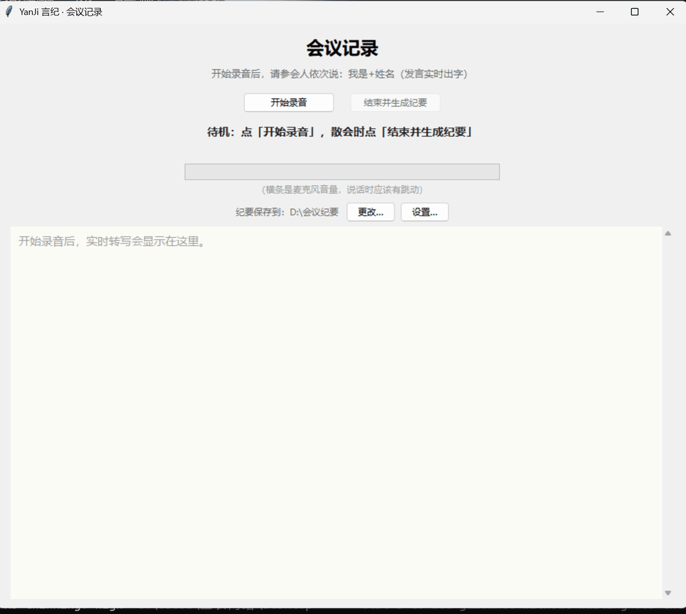
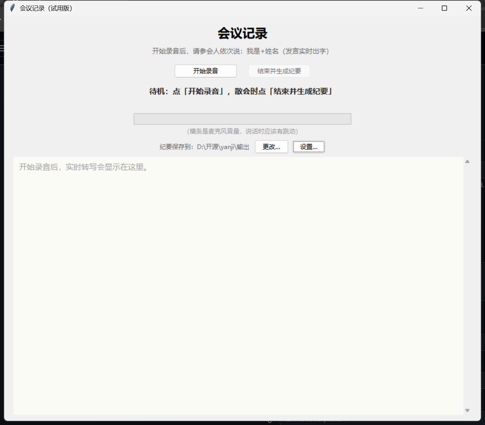
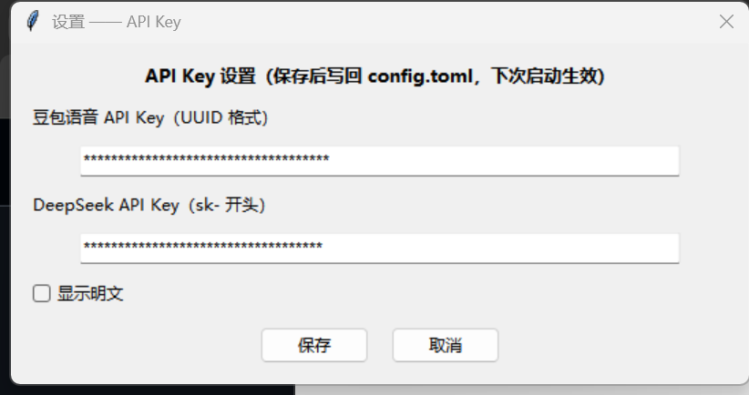
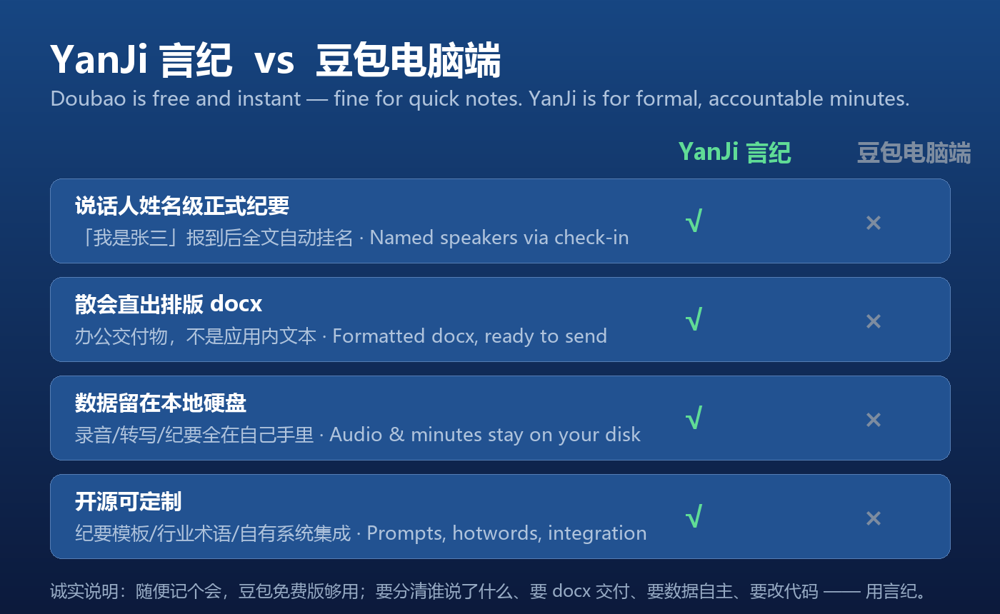

[English](README.md) | [简体中文](README.zh-CN.md)

# YanJi 言纪 · AI Meeting Minutes for Chinese Teams

[](LICENSE) [](https://github.com/sannongwangluo/yanji/releases/latest) [](https://github.com/sannongwangluo/yanji/releases) [](https://github.com/sannongwangluo/yanji) [](https://github.com/sannongwangluo/yanji/actions/workflows/ci.yml)

A Windows desktop tool for Chinese-language meetings: **live transcription with speaker labels while the meeting runs, and one-click minutes exported as Word + Markdown when it ends**.

**[Download YanJi.exe for Windows →](https://github.com/sannongwangluo/yanji/releases/latest)**



## Screenshots

Main window (scrolling live transcript + microphone level meter):



Settings window (fill in or change the Volcano Speech and DeepSeek API keys):



## How it works


## Features

- **Real-time transcription**: Volcano Doubao LLM streaming speech recognition 2.0 (duration edition) over a bidirectional WebSocket, uploading 200 ms audio packets in real time; `enable_nonstream` two-pass recognition shows each speaker's words live in the main window
- **Who said what**: Volcano `ssd` speaker diarization plus "check-in mapping" — each attendee says "I'm + name" at the start to bind a name (no voiceprint needed); unattributed speakers show as "Speaker N"
- **Network-proof**: exponential-backoff auto-reconnect (up to 5 attempts); every utterance is appended to `日志/transcript_*.jsonl` in real time, so a crash loses at most a line or two
- **Output**: DeepSeek organizes the transcript by speaker turns into a docx with three-level formatting (heading / body / list), exported as a matched docx + md pair

## Quick start

1. Launch the app and click **Start recording** (phone, omnidirectional mic, or laptop mic all work)
2. Hold the meeting. **At the start, each attendee says "I'm + name" once**, e.g. "我是张三" — the window scrolls live lines like `张三：……`
3. Click **Finish & generate minutes** when the meeting ends: the transcript is already collected in real time and goes straight to DeepSeek, usually producing the docx in a minute or two and opening the output folder

> The status bar shows "streaming connected / N utterances recognized". Recognition is real-time, so after the meeting you only wait for the minutes generation, not for recognition.

## Configuration (one-time, ~10 minutes)

The app needs two things, both configured in `config.toml` (copy `config.example.toml` and rename it to `config.toml`). You can also fill them in the GUI **Settings…** window, which writes them back to `config.toml`.

### Step 1: Volcano Engine "Doubao Speech" — API key + enable streaming recognition

1. Open https://console.volcengine.com/speech/new/ (the new console, not the old `/speech/app`)
2. Left menu → Speech recognition → **Enable "Streaming Speech Recognition 2.0 (duration edition)"** (this step is the easiest to miss)
3. Click "API access" in the top-right → "Get API key" → create a key and copy the UUID-style string
4. Put it in `config.toml` under `[volc]`: `api_key = "paste here"` (or set the `VOLC_API_KEY` environment variable)

### Step 2: DeepSeek (the minutes brain)

1. Sign up on the DeepSeek platform and top up a small amount (a few yuan lasts a long time)
2. Create an API key and put it in `config.toml` under `[deepseek]`: `api_key` (or set the `DEEPSEEK_API_KEY` environment variable)

Restart, click "Start recording" → say something → "Finish & generate minutes"; if a document comes out, you're all set.

## Running

```bash
python yanji.py           # English entry point (equivalent to the Chinese one below)
python 会议记录.py        # Chinese entry point
```

CLI verification / fallback path:

```bash
python pipeline.py --test-stream-wav <wav>   # real streaming loopback (feeds audio in 200 ms chunks)
python pipeline.py <wav>                     # file-recognition path (fallback)
```

Run the tests:

```bash
python -m unittest discover -s tests         # 54 test cases
```

## Fallback path: file recognition (--file-mode)

When streaming won't connect (no streaming quota, network restrictions, etc.), the file path can still produce a transcript — the recorded wav is uploaded to Volcano TOS, a "recording file recognition 2.0" job is submitted, and the result goes through the same mapping → minutes → docx pipeline:

```bash
python pipeline.py 录音/会议录音_20260902_0930.wav
```

This path needs the extra `[tos]` section (IAM keys + bucket). The default streaming path doesn't use it and can be left empty.

## Known limitations

1. **Speaker splitting**: Volcano `ssd` may split one person into multiple labels on low-volume or far-field speech (physical fix: sit closer, speak up, or use an omnidirectional mic)
2. **Label drift**: speaker labels may drift after a reconnect (each reconnect is a new diarization session; double-check names in Word afterward)
3. **Windows only**: this tool targets the Windows desktop
4. **Pay-as-you-go**: both the Volcano speech recognition and DeepSeek APIs are billed by usage

## Why the cloud (vs local solutions)

Compared with local solutions like meetily, we use the cloud in exchange for **Chinese recognition quality** (small local models hallucinate a lot on Chinese meeting audio) and **out-of-the-box Chinese docx minutes**. A local engine (SenseVoice) is on the roadmap; teams that are uncomfortable sending audio to the cloud should pick a local solution instead.

## vs Doubao desktop (豆包电脑端)

Doubao's own desktop app ships a free "meeting record" feature built on the same Volcano ASR family — so why YanJi? For quick casual notes, honestly, Doubao is enough. YanJi is for **formal, accountable minutes**:



- **Named speakers**: attendees check in with "我是X" and every line is attributed — Doubao's transcript can't tell who said what
- **Formatted docx deliverable** the moment the meeting ends, not text inside an app
- **Your data stays on your disk**: audio, transcripts and minutes live locally; only API calls leave the machine — not stored in a consumer cloud account
- **Open source**: customize the minutes prompt, inject industry hotwords, integrate with your own systems

## Privacy (please read)

1. Audio is uploaded as a **real-time stream** to your own Volcano Engine cloud for recognition; **the cloud does not persist the audio file**
2. The recognized text is sent to DeepSeek to generate the minutes (another AI cloud service)
3. A local recording is kept in the `录音` folder (used by the fallback path if streaming is unavailable); delete it yourself if you don't need it
4. Every utterance is also kept locally in `日志/transcript_*.jsonl`, so a crash or power loss won't lose the transcript
5. For meetings involving trade secrets, assess for yourself whether cloud recognition is appropriate; this tool sends data only to the two services above

## Cost

- Speech recognition and polishing are both pay-per-use; see the consoles for current pricing
- Minutes generation (DeepSeek): a few cents per meeting
- Total: about **¥1 for a one-hour meeting** (both billed by usage)

## FAQ

**Q: Who is "Speaker 3" in the minutes?**
A: That attendee's "I'm XX" check-in wasn't heard clearly. Find the recording in `录音` or just edit "Speaker 3" to the real name in Word. Next time, have them check in clearly and closer to the mic.

**Q: The status bar shows "connection interrupted, reconnecting…"?**
A: The network hiccuped; the app reconnects automatically (up to 5 attempts with exponential backoff). Transcription resumes after a successful reconnect, but note that speaker labels may drift — verify names in Word afterward. If it never reconnects, recording continues unaffected; use the fallback path to produce the transcript later.

**Q: Connection fails with "streaming recognition failed"?**
A: Go to https://console.volcengine.com/speech/new/ → Speech recognition → enable models → confirm "Streaming Speech Recognition 2.0 (duration edition)" is enabled (takes a few minutes to take effect), and check `api_key` in `config.toml`.

**Q: Error "recording file recognition not enabled" (code 45000030)?**
A: This is only needed for the **fallback file path**. Go to https://console.volcengine.com/speech/new/ and enable "Recording File Recognition 2.0".

**Q: Fallback path errors with "upload to TOS denied (403)" or "cannot download audio" (45000006)?**
A: The bucket policy isn't set up. Add a "folder read/write" policy (both read **and** write).

**Q: Where did my minutes go?**
A: In the `输出` folder next to the app, named `会议纪要_YYYYMMDD_HHMM.docx`.

## Roadmap

- **Demo GIF** — a short animated demo of the live transcription workflow (coming soon)
- **CI auto-packaging** — `YanJi.exe` is built automatically on every release tag (added in this change)
- **v2 local privacy engine** — SenseVoice on-device recognition: whole-audio recognition first, speaker diarization after
- **More export formats** — Markdown and other formats

## License

[MIT](LICENSE) © 2026 Hangzhou Sannong Network Technology Co., Ltd.

Website [88lv.com](https://88lv.com) · Contact [contact@88lv.com](mailto:contact@88lv.com)
