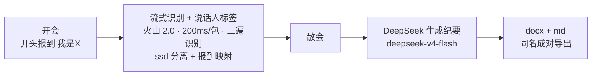

[English](README.md) | [简体中文](README.zh-CN.md)

# YanJi 言纪 · 中文会议记录工具

[](LICENSE) [](https://github.com/sannongwangluo/yanji/releases/latest) [](https://github.com/sannongwangluo/yanji/releases) [](https://github.com/sannongwangluo/yanji) [](https://github.com/sannongwangluo/yanji/actions/workflows/ci.yml)

一个给中文团队开会用的小工具：**开会时边说边出带说话人标签的文字，散会一键生成会议纪要并导出 Word + Markdown**。

**[下载 YanJi.exe（Windows 版）→](https://github.com/sannongwangluo/yanji/releases/latest)**


## 截图

主窗口（实时滚动转写区 + 麦克风电平显示）：


设置窗（填写/修改豆包语音与 DeepSeek 两个 API Key）：


## 工作流程



## 特性

- **实时转写**：火山豆包大模型流式语音识别 2.0（时长版），WebSocket 双向流式，200ms 一包实时上行；`enable_nonstream` 二遍识别，开会时主窗口实时滚动每个人的发言
- **谁说了什么**：火山 ssd 说话人分离 + 「报到映射」——会初每人说一句「我是+姓名」即绑定名字，免声纹；未报到显示「说话人N」
- **断线不怕**：网络抖动指数退避自动重连（最多 5 次）；每句转写实时落盘 `日志/transcript_*.jsonl`，崩机不丢
- **出什么**：DeepSeek 按发言人轮次整理，产出 docx 会议纪要（三档排版：标题/正文/列表），docx + md 同名成对导出

## 快速开始（三步）

1. 启动程序，点 **【开始录音】**（手机、全向麦或电脑麦克风都行）
2. 开会。**开头先每人依次说一句「我是+姓名」**，比如「我是张三」——窗口里实时滚动出 `张三：……` 的文字
3. 散会时点 **【结束并生成纪要】**：转写稿开会时已经实时攒好，直接交给 DeepSeek，通常一两分钟出 docx，自动打开「输出」文件夹

> 状态行随时显示「流式已连接 / 已识别 N 句」。识别是实时的，散会后基本不用等识别，只在生成纪要时等一两分钟。

## 首次配置（只配一次，约 10 分钟）

程序需要两样东西，都配在项目里的 `config.toml`（先复制 `config.example.toml` 改名为 `config.toml`）。也可以在 GUI「设置…」窗里填，保存后写回 `config.toml`。

### 第 1 步：火山引擎「豆包语音」—— API Key + 开通流式识别

1. 打开 https://console.volcengine.com/speech/new/ （新版控制台，不是旧版 `/speech/app`）
2. 左侧菜单 →「语音识别」→ 点「开通模型」，**开通「流式语音识别 2.0（时长版）」**（这一步最容易被漏掉）
3. 点页面右上角「API 调用」→「获取 API Key」→ 创建 API Key，复制那串 UUID 样式的 Key
4. 填到 `config.toml`：`[volc]` 的 `api_key = "粘贴到这里"`（也可以设环境变量 `VOLC_API_KEY`）

### 第 2 步：DeepSeek（生成纪要的大脑）

1. 在 DeepSeek 开放平台注册并充值一点点（几块钱能用很久）
2. 创建 API Key，填到 `config.toml`：`[deepseek]` 的 `api_key`（也可以设环境变量 `DEEPSEEK_API_KEY`）

配完重启程序，点「开始录音」→ 说句话 → 「结束并生成纪要」，出文档就说明通了。

## 运行

```bash
python yanji.py           # 英文入口（等价于下面的中文入口）
python 会议记录.py        # 中文入口
```

命令行验收 / 备用路径：

```bash
python pipeline.py --test-stream-wav <wav>   # 流式真实链路验收（200ms 实时喂音频）
python pipeline.py <wav>                     # 文件识别路径（备用）
```

跑测试：

```bash
python -m unittest discover -s tests         # 54 个用例
```

## 备用路径：文件识别（--file-mode）

流式连不上（没开流式额度、网络受限等）时，可以用文件识别路径补出稿——录好的 wav 上传火山对象存储 TOS，提交「录音文件识别 2.0」任务，轮询出结果后走同一条 映射 → 纪要 → docx 管线：

```bash
python pipeline.py 录音/会议录音_20260902_0930.wav
```

这条路径需要额外配置 `[tos]` 一节（IAM 密钥 + 存储桶），**默认流式主流程用不到，可留空**。

## 已知限制

1. **说话人分裂**：火山 ssd 对低音量/远场语音可能把同一人分裂成多个标签（物理层解决：靠近麦、大声、用全向麦）
2. **标签漂移**：断线重连后说话人标签可能漂移（新连接是新分离会话，散会后请在 Word 里核对人名）
3. **仅 Windows**：本工具面向 Windows 桌面
4. **按量付费**：火山语音识别与 DeepSeek 两个 API 都按量付费

## 为什么走云端（vs 本地方案）

与 meetily 等本地方案相比，我们走云端，换来的是**中文识别质量**（本地小模型在中文会议场景幻觉较多）+ **开箱即用的 docx 中文纪要**。本地引擎（SenseVoice）在 roadmap 中；介意音频上云的团队请选择本地方案。

## 和豆包电脑端有什么区别

豆包电脑端自带免费的「会议记录」，识别技术和言纪同源——那为什么要用言纪？老实说，**随便记个会，豆包免费版够用**。言纪是给**要分清责任的正式纪要**准备的：


- **说话人带名字**：参会人开场说「我是X」报到，全文自动挂名——豆包的转写分不清谁说了什么
- **散会直出排版好的 docx** 办公交付物，不是应用里的一段文本
- **数据在自己硬盘上**：录音、转写、纪要全在本地，只有 API 调用出门——不存在消费级云账号里
- **开源可改**：纪要模板、行业术语热词、对接自有系统，随便定制

## 隐私说明（请务必读）

1. 音频以**实时流**方式上传到你自己的火山引擎云端做语音识别，**云端不保存音频文件**
2. 识别出的文字会发给 DeepSeek 生成纪要（也是一家 AI 云服务）
3. 本地会保留一份录音文件在「录音」文件夹（流式不可用时可用备用路径补出稿），不需要可以自己删
4. 每句转写也会留在本地「日志」文件夹的 `transcript_*.jsonl` 里，崩机/断电也不丢
5. 涉及商业机密的会议，建议自行评估是否适合用云端识别；本工具不会把数据发给除以上两家之外的任何服务

## 成本

- 语音识别与整理均按量计费，具体价格以两个控制台页面为准
- 纪要生成（DeepSeek）：每次几分钱
- 合计：**一小时会议约 1 元**（两者均按量付费）

## 常见问题

**Q：纪要里出现「说话人3」是谁？**
A：说明这位参会人报到那句「我是XX」没被听清。找到「录音」里的录音或直接在 Word 里把「说话人3」改成真名即可。下次开会让 TA 报到时说清楚、离麦近一点。

**Q：状态行显示「连接中断，自动重连中…」？**
A：网络闪断了，程序会自动重连（最多 5 次、指数退避）。重连成功后文字会继续出；注意日志会提示「说话人标签可能漂移」——新连接的说话人编号可能和之前对不上，散会后在 Word 里核对一下人名。一直连不上会提示「连接已断开」，录音不受影响，散会可用上面「备用路径」补出稿。

**Q：连接失败提示「流式识别失败」？**
A：去 https://console.volcengine.com/speech/new/ → 语音识别 → 开通模型 → 确认已开通「流式语音识别 2.0（时长版）」（开通后有分钟级生效延迟），并检查 `config.toml` 的 `api_key`。

**Q：报错「还没开通录音文件识别」（错误码 45000030）？**
A：这是**备用文件路径**才需要的。去 https://console.volcengine.com/speech/new/ → 开通「录音文件识别2.0」再试。

**Q：备用路径报错「上传音频到 TOS 被拒绝（403）」或「下载不到音频」（45000006）？**
A：桶策略没配好。给桶加「文件夹读写」策略（**读和写都要**）。

**Q：生成的纪要不见了？**
A：在程序所在文件夹的「输出」文件夹里，文件名 `会议纪要_年月日_时分.docx`。

## 路线图

- **CI 自动打包**：发布 tag 时自动构建 `YanJi.exe`（本次已加入）
- **v2 本地隐私引擎**：SenseVoice 本地识别——整段识别先行、说话人分离后置
- **更多导出格式**：Markdown 等

## License

[MIT](LICENSE) © 2026 杭州三农网络科技有限公司

官网 [88lv.com](https://88lv.com) · 联系 [contact@88lv.com](mailto:contact@88lv.com)
